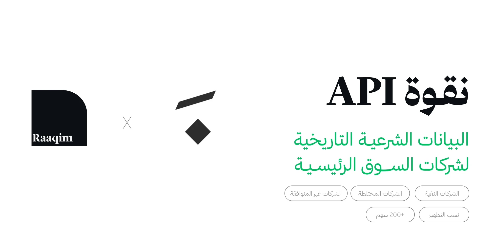
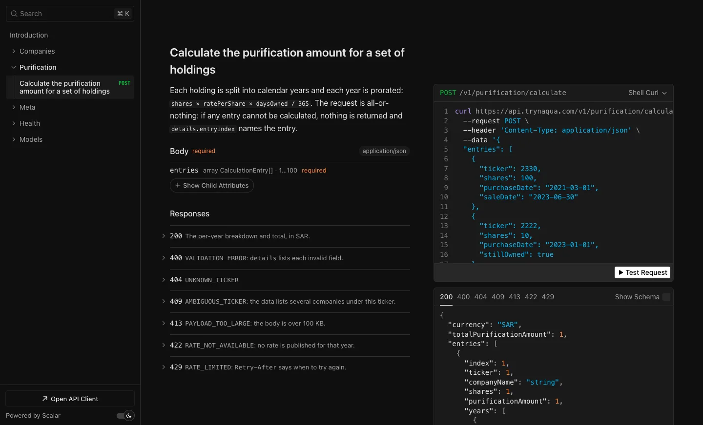
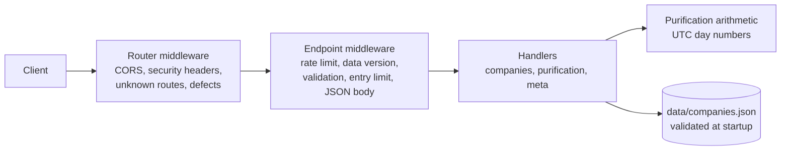

<picture>
  <source media="(prefers-color-scheme: dark)" srcset=".github/readme_banner_darkmode.webp">
  <source media="(prefers-color-scheme: light)" srcset=".github/readme_banner_lightmode.webp">
  
</picture>

<p align="center">
  <picture>
    <source media="(prefers-color-scheme: dark)" srcset=".github/readme_tagline_darkmode.svg">
    <source media="(prefers-color-scheme: light)" srcset=".github/readme_tagline_lightmode.svg">
    
  </picture>
</p>

<p align="center">
  <a href="https://trynaqua.com"></a>
  <a href="https://api.trynaqua.com/docs"></a>
  <a href="data/companies.json"></a>
  <a href="LICENSE"></a>
  <a href="#license"></a>
</p>

Naqua is a public API for purifying Saudi (Tadawul) stocks. It serves the purification rate published for each company and year, and it calculates how much to purify for a set of holdings. It runs the same calculation as the calculator on [trynaqua.com](https://trynaqua.com), and a test sweep holds the two to the same numbers.

| Companies | Years | Company-years | With a rate | Pure | Mixed | Non-pure | Public sector |
| --------: | ----: | ------------: | ----------: | ---: | ----: | -------: | ------------: |
|       219 |    10 |         1,389 |       1,386 |  845 |   461 |       76 |             6 |

<sub>From data version <code>3f812625bb70</code>, which covers 2015 to 2024. Each status counts company-years, because a company can change status from one year to the next. One year has a rate but no status.</sub>

<p align="center">
  
  
</p>

The rates are the ones published by the [Al-Maqased Center for Economic Consultations](https://almaqased.net) (مركز المقاصد للاستشارات الاقتصادية), under the supervision of Dr. Mohammed bin Saud Al-Osaimi (د. محمد بن سعود العصيمي). This repository's license does not cover them. For details, see [License](#license).

> [!NOTE]
> The rates and amounts are for information only. They are not a fatwa or financial advice. For a ruling on your own holdings, consult a qualified scholar.

## Try it

**Calculate.** Use the calculator on [trynaqua.com](https://trynaqua.com).

**Ask the API.** You need no key and no sign-up:

```bash
curl https://api.trynaqua.com/v1/companies/2330/rates/2023
```

**Run it locally.** You need Node 24 and pnpm 12.4.2, which `package.json` pins and Corepack provides. Then run:

```bash
git clone https://github.com/raaqimorg/naqua.git
cd naqua
corepack enable
pnpm install --frozen-lockfile
pnpm dev
```

The API is then at http://localhost:3000, which redirects to its interactive docs at http://localhost:3000/docs. There is no build step: Node runs the TypeScript in `src/` as it is, in production too. The server does not read `.env` files, so set these variables in your shell or your hosting dashboard:

| Variable              | Default                    | Purpose                                                |
| --------------------- | -------------------------- | ------------------------------------------------------ |
| `PORT`                | `3000`                     | HTTP listening port                                    |
| `PUBLIC_URL`          | `https://api.trynaqua.com` | Server URL shown in the OpenAPI document and the docs  |
| `REQUESTS_PER_MINUTE` | `60`                       | Requests per minute per IP address, a positive integer |

For interactive docs that send requests to your local server, start it with `PUBLIC_URL=http://localhost:3000`.

## API

`https://api.trynaqua.com/v1` serves JSON for companies, their yearly rates, and purification amounts. To explore it, open the [interactive docs](https://api.trynaqua.com/docs) or the [OpenAPI 3.1 document](https://api.trynaqua.com/openapi.json).

| Method | Path                                  | Returns                                           |
| ------ | ------------------------------------- | ------------------------------------------------- |
| `GET`  | `/v1/companies`                       | Every company, with the years that have a rate    |
| `GET`  | `/v1/companies/{ticker}`              | One company and everything known about each year  |
| `GET`  | `/v1/companies/{ticker}/rates/{year}` | One year's rate                                   |
| `POST` | `/v1/purification/calculate`          | The purification amount for up to 100 holdings    |
| `GET`  | `/v1/meta`                            | Coverage, data version, unit, formula, and limits |
| `GET`  | `/health`                             | Liveness, without a rate limit                    |

A calculation takes each holding either by dates or by a count of days:

```bash
curl -s https://api.trynaqua.com/v1/purification/calculate \
  -H 'Content-Type: application/json' \
  -d '{"entries":[
        {"ticker":2330,"shares":100,"purchaseDate":"2021-03-01","saleDate":"2023-06-30"},
        {"ticker":2222,"shares":10,"purchaseDate":"2023-01-01","stillOwned":true},
        {"ticker":2001,"shares":50,"year":2022,"daysOwned":200}
      ]}'
```

| Limit    | Value                                                  |
| -------- | ------------------------------------------------------ |
| Requests | 60 per minute per IP address, on the `/v1` endpoints   |
| Holdings | 100 per calculation                                    |
| Body     | 100 KiB                                                |

Every response from a `/v1` endpoint, including an error, reports `RateLimit-Limit`, `RateLimit-Remaining`, and `RateLimit-Reset`. A refused request gets 429 with `Retry-After`. Each of those responses also carries `X-Data-Version`, which changes whenever the data does, and a successful `GET` may be cached for an hour.

An error always has one shape: `{ "error": { "code", "message": { "ar", "en" }, "details"? } }`. A calculation is all-or-nothing, and `details.entryIndex` names the entry that failed.

<details>
<summary><b>How the amount is calculated</b></summary>
<br>

A holding is split into calendar years, and each year is prorated: `shares × ratePerShare × daysOwned / 365`.

In date mode, the sale day is not counted, so a full year runs from 1 January to the next 1 January (365 days, or 366 in a leap year). A `stillOwned` holding runs until the last day of the data (`coverage.end`), not until today, and that day is not counted either. The divisor is always 365, so a leap year held in full comes to 366/365 of that year's rate. Both rules match the website's calculator.

Days mode has no calendar. The count is cut into consecutive 365-day years, starting from `year`.

Amounts are in SAR, rounded to 10 decimal places in the same order as the website. The total sums every yearly amount, not the rounded subtotal of each holding.

</details>

<details>
<summary><b>Error codes</b></summary>
<br>

The codes are stable.

| Code                 | Status                                |
| -------------------- | ------------------------------------- |
| `VALIDATION_ERROR`   | 400, with at most 20 invalid fields   |
| `UNKNOWN_TICKER`     | 404                                   |
| `RATE_NOT_AVAILABLE` | 404 on a lookup, 422 in a calculation |
| `AMBIGUOUS_TICKER`   | 409                                   |
| `PAYLOAD_TOO_LARGE`  | 413                                   |
| `RATE_LIMITED`       | 429                                   |
| `NOT_FOUND`          | 404, for a route that does not exist  |
| `INTERNAL_ERROR`     | 500                                   |

An oversized request that declares its content length gets 413. On the Node server, an oversized chunked upload can close the connection before an error response is sent.

</details>

## Data

[`data/companies.json`](data/companies.json) is the dataset that the API serves. The server loads and validates it at startup, so a malformed file stops the deploy instead of breaking requests.

```jsonc
{
  "schemaVersion": 1,
  "unit": "SAR to purify per share held for a full year",
  "coverage": { "start": "2015-01-01", "end": "2024-12-31" },
  "companies": [
    {
      "ticker": 2330,
      "name": "المتقدمة",
      "aliases": [],                    // former or alternative names
      "years": {
        "2015": { "rate": 0.0199, "status": "mixed" },
        "2016": { "rate": 0.0139, "status": "mixed" }
      }
    }
  ],
  "unresolved": [ /* tickers the source gives to two companies, see below */ ]
}
```

- Every year has the same shape: a `rate`, which is SAR per share for a full year (not a percentage) or `null` if none was published, and a `status`, which is `pure`, `mixed`, `non-pure`, `public-sector`, or `null` if unknown. Zero is a valid rate. A year with neither is left out.
- There is no company-wide category. Classification is per year, and the API derives an `overallStatus`: the status if it never changed, and `varies` if it did.
- Tickers are unique. When the source gives one ticker to two different companies, the ticker goes in `unresolved` with every candidate kept. The API answers `409 AMBIGUOUS_TICKER` for it until someone decides which one is right.
- The file has one canonical layout: sorted by ticker, with one year per line. A rate change then shows up as a one-line diff.

The dataset began as the purification data behind trynaqua.com. This repo keeps a validated snapshot of it, so the API and its tests need neither the private website repository nor a network connection.

<details>
<summary><b>Editing the data</b></summary>
<br>

1. Edit `data/companies.json`. Add a yearly entry only where a published rate or status is available. To extend the data past 2024, also move `coverage.end`.
2. Run `pnpm data:format`. It validates the file and restores the canonical layout.
3. Run `pnpm test`. If a change alters a number that the website still computes differently, the parity test fails. That is intended; see [Parity with the website](#parity-with-the-website).

To resolve an `unresolved` ticker, move the correct candidate into `companies` and add its `ticker`. Then give the other candidate its real ticker, or drop it.

</details>

## How it works

A request reaches the Node server on Render. The router middleware applies what every response needs. Each endpoint then runs its own middleware, such as the rate limit and request validation, before its handler. The handlers read the dataset that was validated at startup, and they compute amounts with the purification arithmetic.



| Part                                                     | Role                                                                      |
| -------------------------------------------------------- | ------------------------------------------------------------------------- |
| [`src/server.ts`](src/server.ts)                         | Starts the HTTP server once the dataset has loaded                        |
| [`src/app.ts`](src/app.ts)                               | Assembles the API, the docs page at `/docs`, and the router middleware    |
| [`src/http/`](src/http)                                  | Endpoint definitions, schemas, the error envelope, middleware, handlers   |
| [`src/domain/`](src/domain)                              | The purification arithmetic, and dates as UTC day numbers                 |
| [`src/data/`](src/data)                                  | The dataset's schema, its loading, and its canonical layout               |
| [`scripts/format-dataset.ts`](scripts/format-dataset.ts) | `pnpm data:format`, which validates the dataset and restores its layout   |
| [`test/`](test)                                          | API, parity, and contract tests, with their recorded fixtures             |

The stack is Node 24, which strips the types and runs the TypeScript directly, and [Effect](https://effect.website) 4 for the HTTP API, validation, and the OpenAPI document. The docs page is [Scalar](https://scalar.com).

Production runs on Render, from [`render.yaml`](render.yaml): `corepack pnpm install --frozen-lockfile --prod`, then `node src/server.ts`. There is no build artifact, so what runs in production is exactly what the tests ran.

<details>
<summary><b>Deploying to Render</b></summary>
<br>

- **First time:** Render → New → Blueprint → this repo. Use the service's assigned `onrender.com` hostname as the DNS target for your custom domain. A fork should change `domains` in `render.yaml`, and set `PUBLIC_URL` to its own API address.
- **Free plan:** the service sleeps after about 15 idle minutes, and the next request waits for a cold start. Use `/health` for liveness monitoring.
- **Rate limiting is in memory.** It is correct only while there is one instance, and it resets on every restart. It keys on the first `X-Forwarded-For` address when that is a real IP address, and it tracks at most 10,000 clients at a time, so made-up addresses cannot run it out of memory. Treat it as a courtesy limit, not as protection against abuse.
- **After the first deploy,** check whether Render lets a client choose that address. If all 70 of these requests get a 200, it does, and the limiter should key on a header that the proxy sets instead:

  ```bash
  for i in $(seq 70); do
    curl -s -o /dev/null -w '%{http_code}\n' -H "X-Forwarded-For: 198.51.100.$i" https://api.trynaqua.com/v1/meta
  done | sort | uniq -c
  ```

- **Rollback:** Render → `naqua-api` → Events → an earlier deploy → Rollback.

</details>

## Parity with the website

[`test/parity.test.ts`](test/parity.test.ts) checks this API against outputs recorded from the website's own calculator code, in [`test/fixtures/legacy-site.json`](test/fixtures/legacy-site.json). It compares every company and year rate, and 1,752 generated holdings in both modes, year by year, down to the last decimal.

The only differences it allows are the data fixes pinned in [`test/fixtures/legacy-differences.json`](test/fixtures/legacy-differences.json). An unexplained new difference fails the test, and so does a listed one that disappears. The website outputs are committed fixtures, so the tests do not need the website checkout.

After an intended change, regenerate the allowed differences with `UPDATE_DIFFERENCES=1 pnpm test`, and **review the diff**. Never do it only to turn a red test green.

## Contributing

Report bugs and ideas in [GitHub issues](https://github.com/raaqimorg/naqua/issues). To change code, do these steps:

1. Open an issue.
2. Fork the repo, and branch off `main`.
3. Run `pnpm check`.
4. Open a pull request into `main`, linked to the issue.

For a data correction, give the source, and review any change to the parity fixtures. [`AGENTS.md`](AGENTS.md) lists what is easy to get wrong in this repo. It is written for AI agents, and it is useful to anyone.

<details>
<summary><b>What <code>pnpm check</code> runs</b></summary>
<br>

`pnpm check` runs the type checker, the linter, and the tests, as CI does on every push to `main` and every pull request.

```bash
pnpm dev          # http://localhost:3000, restarts on change
pnpm test         # node --test
pnpm typecheck
pnpm lint
pnpm check        # all three, as CI runs them
pnpm data:format  # validate data/companies.json and restore its layout
```

Node runs the `.ts` files by stripping their types. That brings three rules, which the compiler and the linter enforce:

- Relative imports spell out `.ts`.
- Type-only imports use `import type`.
- No enums, namespaces, or constructor parameter properties.

[`test/contract.test.ts`](test/contract.test.ts) pins what a client sees. For about 30 requests, covering every endpoint and every error code, it records the status, every header, and the body in [`test/fixtures/contract.json`](test/fixtures/contract.json). After an intended change, re-record it with `UPDATE_CONTRACT=1 pnpm test`, and review the diff.

The `"private": true` field in `package.json` prevents accidental publishing to npm. It does not control the visibility of the GitHub repository, or the code license.

</details>

## Contact

Naqua is part of [Raaqim](https://raaqim.org), an open-source organization behind several Arabic-language projects.

To report a security problem, use **Report a vulnerability** in the repository's Security tab, and keep the report private until the issue is fixed. Please do not open a public issue for a vulnerability.

<sub>Private vulnerability reporting has to be turned on when the repository is made public.</sub>

## License

The code is released under the [MIT license](LICENSE). That license does not cover the purification rates in `data/` and in the test fixtures. They come from the Al-Maqased Center for Economic Consultations, which reserves all rights to its published lists, so ask the center before you reuse them. The lettering at the top of this README is drawn from the [Amiri](https://github.com/aliftype/amiri) typeface, under the SIL Open Font License 1.1.

<br>

<p align="center" dir="rtl">إنَّ اللهَ طيِّبٌ لا يقبلُ إلا طيِّبًا<br><sub>رواه مسلم</sub></p>
