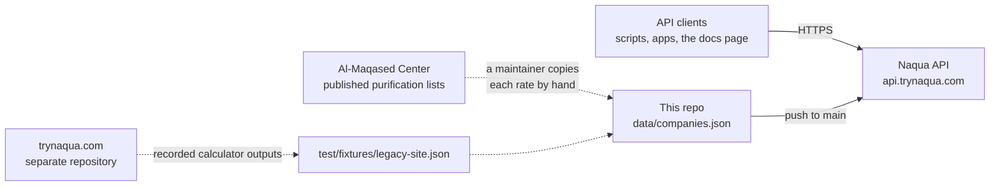
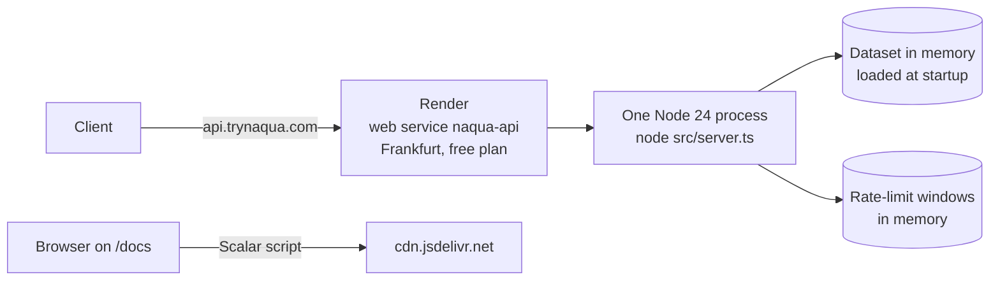
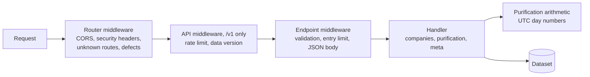
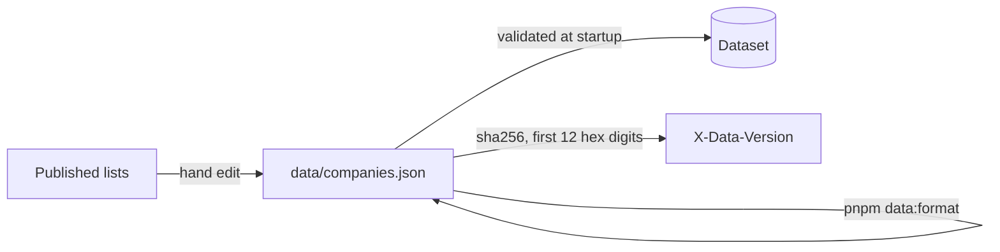
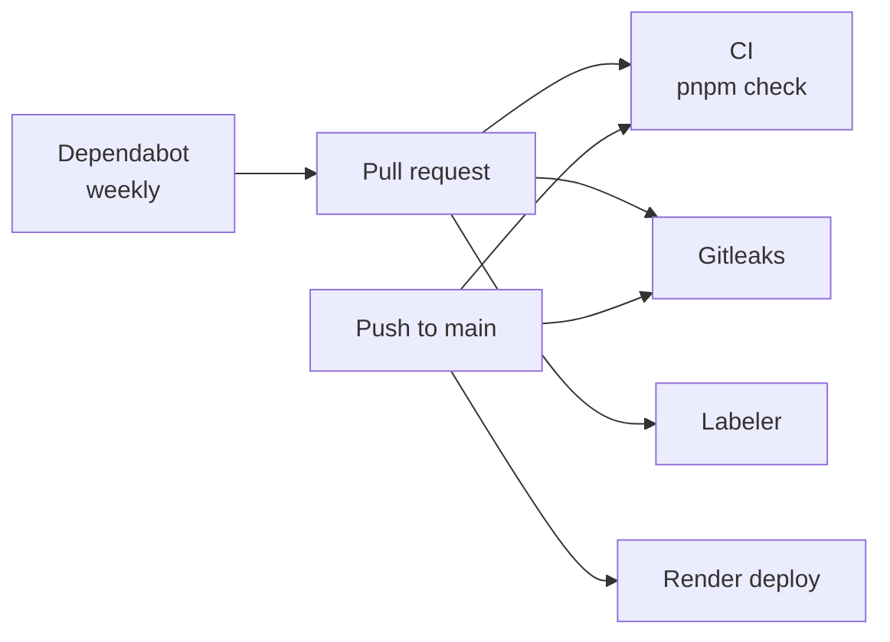

# Topology

This is a diagram-first map of Naqua. It shows who uses the API, what runs where, where the data comes from, and how a change reaches production. The [README](../README.md) has the details of each part, and [`AGENTS.md`](../AGENTS.md) has the rules for changing them.

## System context



Clients call the API directly. It needs no key and no sign-up, and it limits each IP address under `/v1` instead.

The rates come from the Al-Maqased Center's published lists. Nothing fetches them automatically: a maintainer edits `data/companies.json`, and the change ships with the next deploy.

The trynaqua.com website has its own copy of the calculator, in a separate repository. The API never calls it. Instead, its outputs are recorded in `test/fixtures/legacy-site.json`, and the parity test holds the API to those numbers.

## Production deployment



[`render.yaml`](../render.yaml) defines the service. It installs the production dependencies and starts `node src/server.ts`. There is no build step, so production runs the same TypeScript files that the tests ran.

- **One instance.** The rate limiter holds its windows in memory, so it is correct only while one process serves every request, and a restart resets it.
- **Client addresses.** Render sets `RENDER=true`, and then the limiter keys on `CF-Connecting-IP`, which Render's public ingress overwrites. Anywhere else, or when that header is missing or invalid, it keys on the socket address. It never trusts `X-Forwarded-For`.
- **Health check.** Render polls `/health`, which sits outside the rate limit.
- **Cold starts.** On the free plan, the service sleeps after about 15 idle minutes, and the next request waits for it to start.
- **The docs page.** `/docs` is served by the API, but the browser loads Scalar's script from `cdn.jsdelivr.net`, at the version pinned in `SCALAR_VERSION` (`src/app.ts`).

## A request



The router middleware wraps every request, matched or not. It is the only place that builds an error response by hand, for an unknown route and for a defect. Everything else is declared per endpoint in [`src/http/api.ts`](../src/http/api.ts), so its errors appear in the OpenAPI document, and no other spelling of a path can skip it.

`/health` and `/docs` skip the API middleware. Every response from a `/v1` endpoint carries the rate-limit headers and `X-Data-Version`, including an error.

## Data topology



- **One file.** `data/companies.json` is the only source the API serves. A malformed file stops the server at startup, so a bad edit fails the deploy instead of breaking requests.
- **One layout.** `pnpm data:format` sorts the file by ticker and puts one year on each line, so a rate change is a one-line diff.
- **One version.** The data version is a hash of the file. It changes whenever the data does, and clients can cache on it.
- **Disputed tickers.** A ticker that the source gives to two companies stays in `unresolved`, and the API answers `409` for it until a maintainer decides.

## Codebase topology

```text
src/
  server.ts        starts the HTTP server once the dataset has loaded
  app.ts           assembles the API, /docs, / and the router middleware
  config.ts        environment variables and fixed limits
  http/            endpoints, schemas, errors, middleware, handlers, rate limit
  domain/          purification arithmetic and UTC day numbers, plain functions
  data/            the dataset's schema, loading, and canonical layout
data/              companies.json, the hand-edited rate snapshot
scripts/           format-dataset.ts, behind pnpm data:format
test/              API, config, dataset, dates, parity, and contract tests
  fixtures/        contract.json, legacy-site.json, legacy-differences.json
docs/              this file
.github/           CI, issue and pull request templates, community files
```

`src/domain` stays plain functions, as `AGENTS.md` requires, so its arithmetic can be checked directly against the website's. The two fixtures that pin behaviour are regenerated only for an intended change:

- `test/fixtures/contract.json` records the status, headers, and body of every kind of response.
- `test/fixtures/legacy-differences.json` lists every company-year where the API deliberately differs from the website.

## CI/CD topology



| Workflow                                          | Runs on                    | Does                                                           |
| ------------------------------------------------- | -------------------------- | -------------------------------------------------------------- |
| [CI](../.github/workflows/ci.yml)                 | Every pull request, `main` | `pnpm check`: type check, lint, and every test                  |
| [Gitleaks](../.github/workflows/gitleaks.yml)     | Every pull request, `main` | Scans the whole history for committed secrets                  |
| [Labeler](../.github/workflows/labeler.yml)       | Pull requests into `main`  | Adds component and topic labels from the files that changed    |
| [Dependabot](../.github/dependabot.yml)           | Weekly                     | Opens updates for npm packages, grouped, and GitHub Actions    |

Render deploys `main` on its own after each push. A deploy is not gated on CI, so `main` should only receive changes that pass `pnpm check`. To roll back, pick an earlier deploy on the service's Events page in Render.

## External services

| Service        | Used for                                                      |
| -------------- | ------------------------------------------------------------- |
| Render         | Hosting the API, deploying `main`, the health check          |
| GitHub Actions | CI, Gitleaks, and the labeler                                 |
| jsDelivr       | Serving Scalar's script to the `/docs` page                   |
| shields.io     | The badges in the README, nothing that the API depends on     |

## See also

- [README](../README.md): the endpoints, the formula, the data format, and deployment.
- [`AGENTS.md`](../AGENTS.md): what is easy to get wrong when you change the code.
- [`CONTRIBUTING.md`](../.github/CONTRIBUTING.md): how to propose a change.
